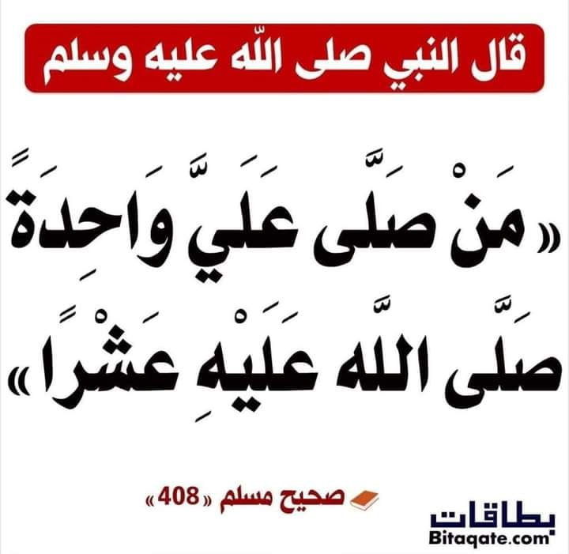

# Lesson 1

## Intro (5 min)
Today's Lesson Objectives:
By the end of class, students should be able to recall these three key takeaways:
- Aqeedah: The first article of faith – Belief in Allah
- Seerah: The early childhood of the Prophet ﷺ – his birthplace, family, and tribe
- Hadith/Sunnah: The reward for sending salutations (Salaam) upon the Prophet ﷺ

## A Lesson on Aqeedah (15 min)

### 6 Articles of Faith Overview
- **Belief in Allah**
- Belief in the Angels
- Belief in the Revealed Books
- Belief in the Messengers
- Belief in the Last Day
- Belief in Divine Decree (Qadar)

### Belief in Allah

 > "Say, He is Allah the One. Allah the Eternal. He does not beget nor is he begotten. And there is nothing like him"

- **Allah is ONE!**
    - *Surah Al-Ikhlas (112) summarizses this*
- **He is the Only One Worthy of Worship**
    - Muslims pray, ask for help, and rely only on Allah.
    - Worshipping others besides Him (like idols, saints, or the dead) is called shirk, the worst sin in Islam.

- **He Has Beautiful Names and Perfect Attributes**
    - 🌟 Ar-Rahmaan – The Most Merciful
        - Allah is very, very kind and loving to everyone — even if they don’t ask or don’t thank Him
        - 🗯️Imagine this: 
            - When you're sleeping, Allah still gives you air to breathe.
            - When you're playing, He gives you the sun, your eyes to see, and your heart to feel joy.
        - It’s like when your mom or dad takes care of you all the time — even when you don’t say thank you — but even more! That’s Ar-Rahmaan.
    - 🌟 Al-‘Aleem – The All-Knowing
        - Allah knows everything — every little thing you do, think, or feel.
        - 🗯️Imagine this:
            - Even if you whisper something, or just think it in your head, Allah knows it.
            - If a tiny ant is walking in the dark under a rock… Allah knows that too!
    - 🌟 Al-Khāliq – The Creator
        - Allah is the One who made everything — from the stars in the sky to the tiny bugs on the ground
        - 🗯️Imagine this:
            - When you draw a picture, you make something — but Allah made real people, animals, trees, and planets from nothing at all!
            - He didn’t need tools or help. He just says “Be!” and it happens. 
    - and many more.
    - We learn about Him through His names and what He tells us in the Qur’an and Sunnah.

- **He Created Everything and Controls Everything**
    - 🌳 Allah created the heavens, the earth, and all living beings.
    - 🌸 Nothing happens except by His will.

-------------------------------------
### ✍🏾 *Activity on Aqeedah (5 min)*
- Activity Name: Triva time!
- Activity Description: ask the kids any questions about Allah renforcing the concepts they just learned.
- See the following for examples [Lesson 1 Aqeedah Triva](./activities/L1-Aqeedah-Triva.md)
-------------------------------------
 
## Lesson on Seerah (15 min)

### When and Where Was He Born? 🏜️
- Year of the Elephant (around 570 CE)
- Born in Makkah

### His Noble Family 👨‍👩‍👦
- Tribe: Quraysh
- Great-grandfather: Hashim
- Grandfather: Abdul Muttalib
- Father: Abdullah (passed away before he was born)
- Mother: Aminah

### Who Took Care of Him? ❤️
- Mother (Aminah) until age 6
- Grandfather (Abdul Muttalib) until age 8
- Uncle (Abu Talib) afterward

-------------------------------------
### ✍🏾 *Activity on Seerah (5 min)*
- Activity Name: Fill in the Blanks - Worksheet
- Activity Description: A worksheet the kids will fill in related to lesson. this worksheet will show the family tree.
-------------------------------------

## Lesson on Hadith/Sunnah (15 min)

>Abu Huraira reported: The Messenger of Allah (ﷺ) said: He who blesses me once, Allah would bless him ten times.

*Source: [Sahih Muslim 408](https://sunnah.com/muslim:408)*

>"Allah loves His Prophet (S), and He loves those who love His Prophet (S). When we send Salam to Rasulullah (S), Allah is pleased and rewards us with His blessing ten times."

*Source: [Iqra International Education Foundation. (n.d.). Teaching of our Prophet (Salla-Allahu 'alaihi wa sallam): A selection of Ahadith for children, elementary level (p. 22).](https://www.iqra.org/products/teachings-of-our-prophet-ahadi?_pos=1&_psq=teaching+of+our&_ss=e&_v=1.0)*

-------------------------------------
### ✍🏾 *Activity on Hadith/Sunnah (15 min)*
- Activity Name: Remeber me _x_ times
- Activity Description: Have the kids repeat the Hadith/Sunnah any number of times to help them get into the habit of remembering it and also ensure they understand what they are remembering 
-------------------------------------
 